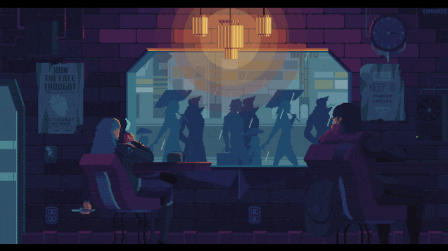

  🌎 
  <a href="README.md">🇧🇷 Português</a> |
  <strong>🇺🇸 English</strong> |
  <a href="README.es.md">🇪🇸 Español</a>

<!-- Banner principal - Inglês -->

  

---

<h3 align="center">💻 Fullstack Developer | Creative Problem Solver | Fueled by Coffee ☕</h3>

  <em>"If it didn’t work, the hack wasn’t done right."</em>

---

### 🚀 About Me  
I’m a **Fullstack Developer** passionate about building creative and functional solutions.  
I turn bugs into features and ideas into code — sometimes with elegance, sometimes with a hack (but always with style 😎).  

🧩 Tech I work with: React, Node.js, PHP, Angular, React Native, TypeScript 
🎯 Goal: Write clean code (but if it doesn’t work, make it *work anyway*)  
📍 Location: Brazil 🌎  

---

### ⚙️ Tech Stack

### Front-end

| JavaScript | TypeScript | React | Next.js | React Native | HTML5 | CSS3 |
|:----------:|:----------:|:-----:|:-------:|:------------:|:-----:|:----:|
|  |  |  |  |  |  |  |

### Back-end & DB

| Node.js | Python | Java | C | Firebase | MongoDB | MySQL |
|:-------:|:------:|:----:|:-:|:--------:|:-------:|:----:|
|  |  |  |  |  |  |  |

### Tools & Others

| Git | Docker | Linux | Jira | ClickUp | YouTrack |
|:---:|:-----:|:----:|:---:|:-------:|:--------:|
|  |  |  |  |  |  |

---

### 📊 Stats

  

  

---

### 🔥 Featured Projects

  🚀 <a href="https://portfolio.or.app.br/">Personal Portfolio</a> — modern animations and transitions. 
  🧩 <a href="https://redacao-ai.or.app.br/">AI Essay Corrector</a> — Next.js app that reviews essays using AI. 
  📱 <a href="https://matematica.or.app.br/">Educational Platform</a> — helping students prepare for ENEM in Brazil.

---

### ☕ Let's Connect

 
  
  
  
   

  

---

  

---

  🌎 
  <a href="README.md">🇧🇷 Português</a> |
  <strong>🇺🇸 English</strong> |
  <a href="README.es.md">🇪🇸 Español</a>

  

