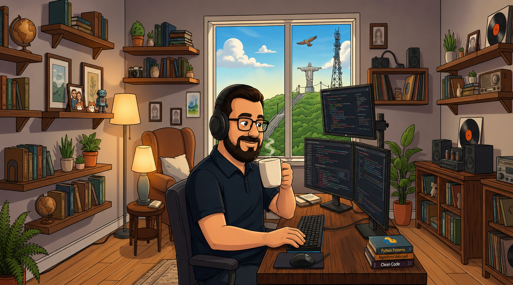

  🌎 
  <a href="README.md">🇧🇷 Português</a> |
  <a href="README.en.md">🇺🇸 English</a> |
  <strong>🇪🇸 Español</strong>

<!-- Banner principal - Espanhol -->

  

---

<h3 align="center">💻 Desarrollador Fullstack | Solucionador Creativo | Impulsado por Café ☕</h3>

  <em>"Si no funciona, es porque la chapuza no estuvo bien hecha."</em>

---

### 🚀 Sobre mí  
Soy un **desarrollador Fullstack** apasionado por crear soluciones creativas y funcionales.  
Transformo errores en funciones y ideas en código — a veces con elegancia, otras con una *chapuza* (¡pero siempre con estilo! 😎).  

🧩 Tecnologías: React, Node.js, PHP, Angular, React Native, TypeScript 
🎯 Objetivo: escribir código limpio (pero si no, que al menos funcione)  
📍 Ubicación: Brasil 🌎  

---

### ⚙️ Stack Tecnológico

### Front-end

| JavaScript | TypeScript | React | Next.js | React Native | HTML5 | CSS3 |
|:----------:|:----------:|:-----:|:-------:|:------------:|:-----:|:----:|
|  |  |  |  |  |  |  |

### Back-end & DB

| Node.js | Python | Java | C | Firebase | MongoDB | MySQL |
|:-------:|:------:|:----:|:-:|:--------:|:-------:|:----:|
|  |  |  |  |  |  |  |

### Tools & Others

| Git | Docker | Linux | Jira | ClickUp | YouTrack |
|:---:|:-----:|:----:|:---:|:-------:|:--------:|
|  |  |  |  |  |  |

---

### 🔥 Proyectos Destacados

  🚀 <a href="https://portfolio.or.app.br/">Portafolio Personal</a> — sitio con animaciones y transiciones modernas. 
  🧩 <a href="https://redacao-ai.or.app.br/">Redacción con IA</a> — aplicación Next.js que corrige textos con inteligencia artificial. 
  📱 <a href="https://aluno.otaviorafael.com.br/">Plataforma Educativa</a> — ayuda a estudiantes a prepararse para el ENEM.

---

### ☕ Dónde encontrarme

 
  
  
  
   

  

---

  

---

  🌎 
  <a href="README.md">🇧🇷 Português</a> |
  <a href="README.en.md">🇺🇸 English</a> |
  <strong>🇪🇸 Español</strong>

  

