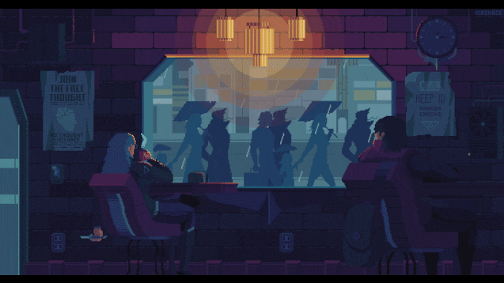

  🌎
  <strong>🇧🇷 Português</strong> |
  <a href="README.en.md">🇺🇸 English</a> |
  <a href="README.es.md">🇪🇸 Español</a>

<!-- Banner principal - Português (BR) -->

  

---

<h3 align="center">💻 Desenvolvedor Fullstack | Solucionador Criativo | Movido a Café ☕</h3>

  <em>"Se não funcionou, é porque a gambiarra não foi bem feita."</em>

---

### 🚀 Sobre mim  
Sou um desenvolvedor **Fullstack** apaixonado por criar soluções criativas e funcionais.  
Transformo bugs em features e ideias em código — às vezes com elegância, às vezes com gambiarra (mas sempre com estilo 😎).  

🧩 Tecnologias que domino: React, Node.js, PHP, Python, TypeScript  
🎯 Objetivo: escrever código limpo (mas se não der, que pelo menos funcione)  
📍 Local: Brasil 🌎 

---

### ⚙️ Tech Stack

### Front-end

| JavaScript | TypeScript | React | Next.js | React Native | HTML5 | CSS3 |
|:----------:|:----------:|:-----:|:-------:|:------------:|:-----:|:----:|
|  |  |  |  |  |  |  |

### Back-end & DB

| Node.js | Python | Java | C | Firebase | MongoDB | MySQL |
|:-------:|:------:|:----:|:-:|:--------:|:-------:|:----:|
|  |  |  |  |  |  |  |

### Tools & Others

| Git | Docker | Linux | Jira | ClickUp | YouTrack |
|:---:|:-----:|:----:|:---:|:-------:|:--------:|
|  |  |  |  |  |  |

---

### 📊 Minhas Estatísticas

  

  

---

### 🔥 Projetos em Destaque

  🚀 <a href="https://portfolio.or.app.br/">Portfólio Pessoal</a> — site com animações e transições modernas. 
  🧩 <a href="https://redacao-ai.or.app.br/">Redação com IA</a> — site em Next.js para corrigir redações com IA. 
  📱 <a href="https://matematica.or.app.br/">Plataforma Educacional</a> — para ajudar estudantes do ENEM no Brasil.

---

### ☕ Onde me encontrar

 
  
  
  
   

  

---

  

---

  🌎
  <strong>🇧🇷 Português</strong> |
  <a href="README.en.md">🇺🇸 English</a> |
  <a href="README.es.md">🇪🇸 Español</a>

  

